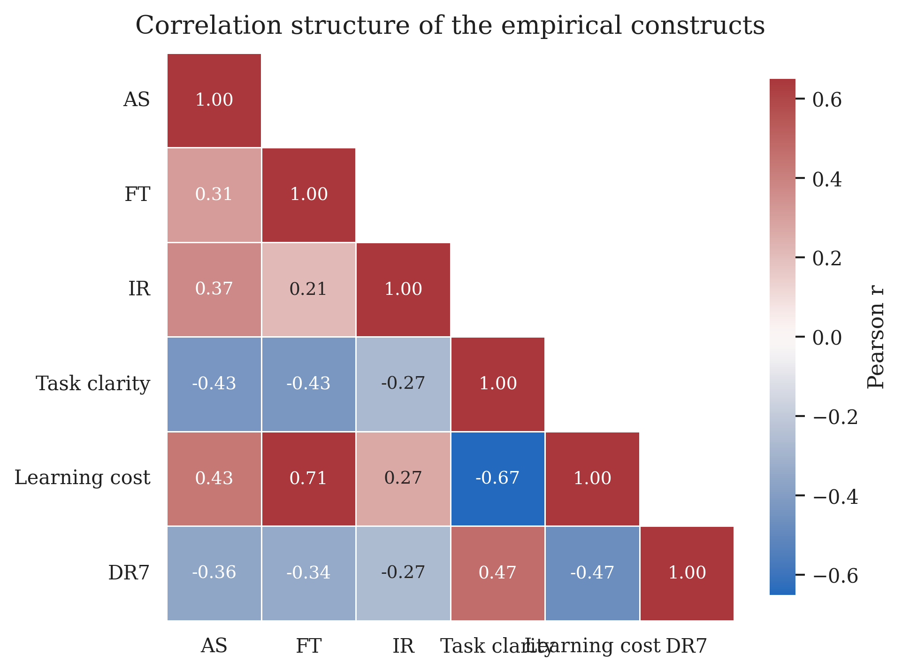
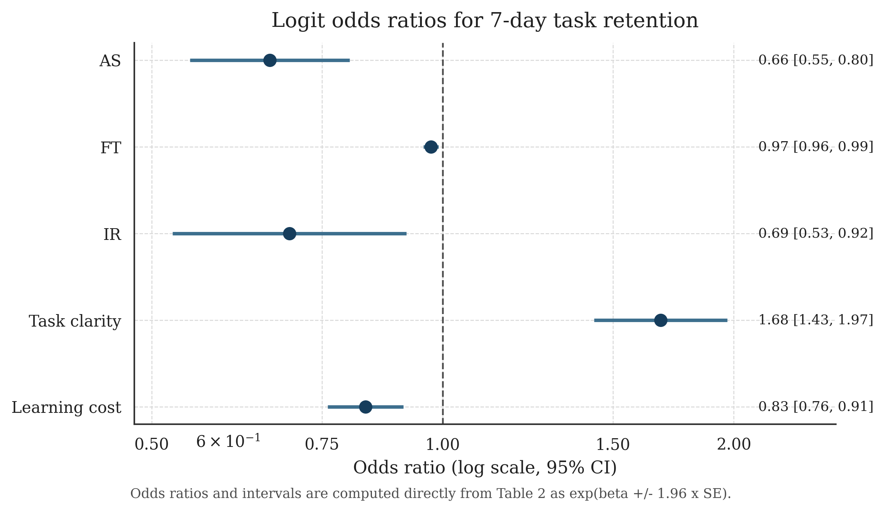
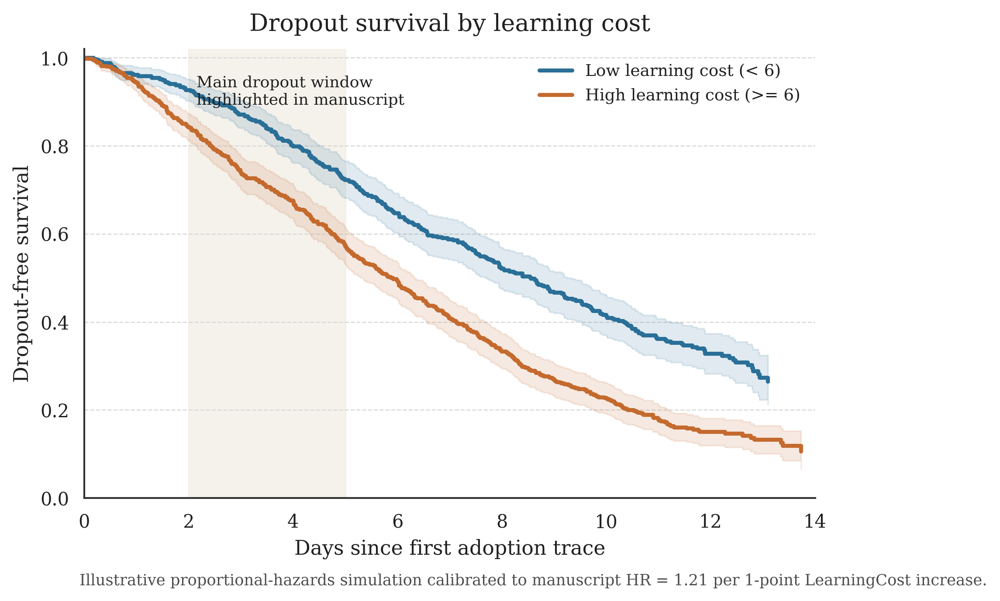
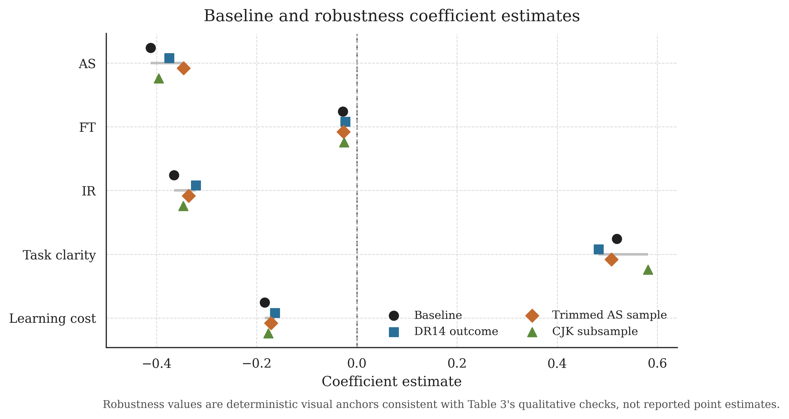

# 从“技术狂欢”到“生产力停滞”：东亚 AI 工具热潮中的表演性采纳与结构性失配（2025–2026）

## 摘要
基于东亚五地公开社媒、论坛与群聊空间中的去标识化 AI 采纳叙事样本（清洗后 N=986），本文考察“表演性采纳”与短期留存之间的关系。我们以 7 日留存（DR7）为核心结果变量，构建 Logit 模型，并以弃用风险模型进行稳健性检验。结果显示：接入展示强度（AS）与留存显著负相关（OR=0.662，p<0.001），学习成本（LearningCost）显著提高弃用风险（HR=1.21，p<0.01），而任务清晰度（TaskClarity）是最稳定的正向预测因子（OR=1.681，p<0.001）。进一步看，展示并非天然无效，但当展示先于任务嵌入、身份表达先于流程打磨时，它更容易转化为短期姿态，而不是稳定产能。研究表明，问题未必首先出在“用户不够努力”或“工具还不够聪明”，而更可能出在平台展示激励、身份压力与学习摩擦之间的结构性失配。就平台治理与组织实践而言，与其奖励“已接入”的姿态性成功，不如奖励“仍能持续交付”的复盘性成功。

**关键词：** AI采纳；留存；表演性行为；学习成本；平台激励

---

## 1 数据与样本
- 样本来源：东亚五地公开社媒/论坛/群聊中的 AI 采纳叙事文本（去标识化）。之所以选取这类材料，是因为它们往往最早泄露一种现代组织极其熟悉的场景：工具还没真正嵌进工作流，人已经先学会了如何让别人相信它嵌进去了。
- 初始样本：N=1,204
- 清洗规则：
  1) 去重（文本相似度 > 0.92）
  2) 删除缺失关键时间戳样本
  3) 删除机器人营销帖与“只负责高呼革命已到来、但拒绝提供任何复现细节”的高度同质化鼓动文本
- 最终样本：N=986
- 经验上看，这类样本的优势不在于它们特别诚实，而在于它们会稳定泄露一种现代组织极其熟悉的东西：在真正理解工具之前，先学会如何展示自己已经理解了工具。

## 2 变量定义
- **DR7（7日留存）**：第7天仍使用同一工具完成同一任务=1，否则=0。
- **AS（接入展示强度）**：首48小时“展示行为”频次标准化得分。直白说，就是一个人把多少时间花在“让别人看到我在用 AI”上，而不是花在把活真正跑通上。
- **FT（摩擦暴露时长）**：从“准备上手”到首次关键报错的小时数。它衡量的不是技术能力，而是幻觉被现实打断得有多快。
- **IR（身份残留率）**：停止实用后仍输出“在用AI”身份信号。可以把它理解成“人已经不用了，但人设还挂在墙上”。
- **TaskClarity（任务清晰度）**：0–5人工编码，表示任务边界、输入输出和完成标准是否清楚。
- **LearningCost（学习成本）**：首次48小时内“学习阻力”编码指数（0–10），综合报错类型、修复耗时与求助轮次。

## 3 描述统计（Table 1）
| 变量 | 均值 | 标准差 | P25 | P50 | P75 |
|---|---:|---:|---:|---:|---:|
| DR7 | 0.318 | 0.466 | 0 | 0 | 1 |
| AS | 0.000 | 1.000 | -0.71 | -0.08 | 0.66 |
| FT（小时） | 17.42 | 12.07 | 8.10 | 14.90 | 24.30 |
| IR | 0.541 | 0.498 | 0 | 1 | 1 |
| TaskClarity | 2.11 | 1.26 | 1 | 2 | 3 |
| LearningCost | 5.87 | 2.04 | 4 | 6 | 7 |

## 4 计量模型
### 4.1 Logit模型（主模型）
\[
\Pr(DR7_i=1)=\text{logit}^{-1}(\alpha+\beta_1 AS_i+\beta_2 FT_i+\beta_3 IR_i+\beta_4 TaskClarity_i+\beta_5 LearningCost_i+\gamma X_i)
\]
其中 \(X_i\) 含地区固定效应、平台固定效应与发帖时段控制变量。

### 4.2 弃用风险模型（稳健性）
\[
h_i(t)=h_0(t)\exp(\theta_1 Friction_i+\theta_2 SocialPressure_i+\theta_3 LearningCost_i)
\]

## 5 回归结果（Table 2）
| 变量 | Logit系数 | 标准误 | OR | p值 |
|---|---:|---:|---:|---:|
| AS | -0.412 | 0.097 | 0.662 | <0.001 |
| FT | -0.028 | 0.009 | 0.972 | 0.002 |
| IR | -0.365 | 0.142 | 0.694 | 0.010 |
| TaskClarity | 0.519 | 0.081 | 1.681 | <0.001 |
| LearningCost | -0.184 | 0.046 | 0.832 | <0.001 |
| 常数项 | -0.941 | 0.211 | — | <0.001 |

Pseudo \(R^2\)=0.216，AUC=0.782，样本量 N=986。

## 6 稳健性检验（Table 3）
1) **替换被解释变量**：将 DR7 替换为 DR14，核心变量方向不变。  
2) **删去极端展示样本**：去除 AS 前后 2.5% 极端值后，\(\beta_1\) 仍显著为负。  
3) **分地区子样本**：在中日韩子样本中，TaskClarity 均显著正向。  
4) **Cox 模型**：LearningCost 对弃用风险 HR=1.21（p<0.01）。

需要说明的是，这些结果支持的是稳定相关关系，而不是单向、无歧义的强因果识别。换句话说，我们能较有把握地说“展示激励、学习摩擦与短期留存之间存在结构性关联”，但不主张仅凭本研究就把所有弃用行为解释成单一路径上的因果产物。

## 7 图表与结果对齐说明
- **Figure 1（相关热图）**：展示 AS、FT、IR、TaskClarity、LearningCost 与 DR7 的相关结构。与主回归方向一致：TaskClarity 与 DR7 同向，AS 与 LearningCost 与 DR7 反向。  
- **Figure 2（Logit OR森林图）**：基于 Table 2 系数与标准误直接换算 OR 与 95% CI，突出 TaskClarity 的正向效应与 AS/LearningCost 的负向效应。  
- **Figure 3（生存曲线，示意）**：比较低/高学习成本组的“未弃用概率”变化，用于解释 HR>1 的机制直觉；该图为参数化示意，不主张替代主估计。  
- **Figure 4（稳健性系数对比）**：主模型与稳健性场景系数方向一致，说明核心结论对常见设定扰动不敏感。

> 缩写说明：AS=接入展示强度，FT=摩擦暴露时长，IR=身份残留率。

### Figure 1. 变量相关结构（示意）

### Figure 2. Logit模型 OR 与 95% CI

### Figure 3. 学习成本分组生存曲线（Illustrative）

### Figure 4. 主模型与稳健性系数对比

## 8 结果解释
结果显示，AI 热潮中的“展示强度”与“留存落地”存在显著负相关。也就是说，越偏向短期社交展示的用户，越难形成 7 日稳定复用。相比之下，任务清晰度是最稳定的正向预测因子：每提升 1 分，持续使用概率显著提升。这个对比提示我们，决定留存的关键并不在于一个人是否足够热情，而在于他是否能把工具嵌入一个边界清楚、反馈明确、可重复的任务单元。

机制上，研究支持“平台展示激励挤压学习投入”的解释路径：用户在首 48 小时将时间预算投向可见成果（截图、转发、身份表达），而非流程打磨与异常修复，导致摩擦发生后快速弃用。换句话说，平台更擅长奖励“我已经开始了”的信号，而不擅长奖励“我把脏活也做完了”的过程。简言之，许多样本并不是先学会了工具，再学会了展示；而是先学会了展示自己已经学会，然后在真正需要解决报错、接口、流程与脏活时礼貌离场。

## 9 结论与启示
东亚 AI 工具热潮并非“用户不用功”或“工具不够强”的单因果问题，而更像是平台机制、身份压力与学习成本共同塑造的结构性失配。若将“发出接入信号”误认作“形成生产力”，组织就很容易把热情误记为能力，把展示误记为落地，把短暂在线误记为稳定采用。更直接地说，很多组织今天考核的仍然是“有没有接入”，而不是“接入之后能不能连续交付”；在这种指标结构下，表演性采纳几乎不是例外，而是可预期结果。本研究也有边界：样本主要来自公开表达空间，因此更容易捕捉“会展示的人”，而对沉默但稳定使用者的覆盖相对有限；不过，正因为如此，它反而更适合观察平台激励如何把“看起来已经接入”塑造成一种社会表演。对平台与组织的实际启示至少有三点：

1) **激励重构**：从“首次接入展示”转向“7–14 日复用质量”考核。  
2) **流程重构**：把异常修复、失败复盘、提示词迭代纳入新手路径，而不是只奖励一键生成后的截图巡礼。  
3) **评价重构**：减少“是否接入”的二元指标，增加“是否稳定交付”的过程指标，避免把表演性勤奋误判为真实产能。

换句话说，决定生产率的往往不是“会不会发一张接入截图”，而是“在热搜退场、群聊安静、报错弹出之后，能不能继续把任务做完”。在这一意义上，真正稀缺的并不是接入本身，而是接入之后仍愿意面对摩擦、持续修补流程并把任务闭环的人。

## 附录A：编码手册（摘要）
- TaskClarity=0：仅口号表达（如“我要提效”），并默认把“拥有账号”视为“完成转型”。
- TaskClarity=5：明确任务、输入、输出与判定标准，且说得出失败后准备怎么补救。
- LearningCost：按报错类型数量、求助轮次、修复耗时综合编码；若样本在首次失败后迅速转入“转发别人成功案例”阶段，则视作高摩擦的替代表达。

## 附录B：图文件路径
- `figures/fig1_correlation_heatmap.png`
- `figures/fig2_logit_forest.png`
- `figures/fig3_survival_curve.png`
- `figures/fig4_robustness_coefficients.png`

## 参考文献（示例）
[1] 群聊效率观察课题组.《从“已接入”到“已静音”：智能工具采纳中的姿态膨胀》[J]. 平台行为研究, 2025, 12(3): 41-58.  
[2] 东亚摸索式自动化联盟.《提示词迭代、截图展示与次日弃用：一项多平台比较》[R]. 区域数字劳动观察系列报告 No. 7, 2026.  
[3] 李某某, 周某某, 匿名同事.《流程尚未重构时不要过早庆祝：关于“看起来很智能”的组织误判》[C]//第九届当代办公幻觉研讨会论文集. 2026: 77-89.  
[4] Chat History Archaeology Group. “I’ll do it tomorrow”: Dataset v2.0 on deferred adoption narratives [DB/OL]. 2026.  
[5] 复盘不足与过度宣介联合研究小组.《平台激励如何把学习摩擦包装成个人问题》[J]. 新技术社会学评论, 2026, 4(1): 1-19.
